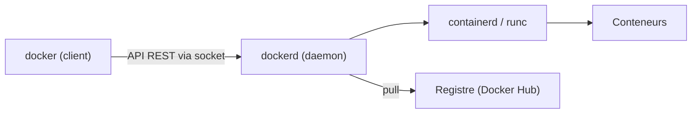

# Contexte

Votre équipe veut livrer ses applications sous forme de conteneurs. Avant d'écrire le moindre `Dockerfile`, il faut un poste de travail fonctionnel, et surtout comprendre ce que l'on vient d'installer : sur Windows et macOS, ce n'est pas tout à fait ce que l'on croit.

Ce TP est volontairement court. Il pose les bases sur lesquelles tous les suivants s'appuient.

---

## Objectifs

<div class="section objective">

1. Distinguer Docker Engine, Docker Desktop, le client et le daemon
2. Installer Docker sur votre système (Windows, Linux ou macOS)
3. Vérifier l'installation et lire la sortie de `docker version` et `docker info`
4. Télécharger puis exécuter l'image `hello-world`
5. Inspecter, arrêter et supprimer conteneurs et images

</div>

> Vous n'avez besoin de traiter que l'installation correspondant à votre système. Si vous avez accès à une seconde machine ou à une VM, faire aussi les autres est un bon exercice.

---

## Étape 1 - Comprendre ce que l'on installe

Le mot « Docker » désigne en pratique plusieurs choses :

| Élément | Rôle |
| --- | --- |
| `docker` (CLI) | Le client en ligne de commande. Il ne fait que parler à une API. |
| `dockerd` (daemon) | Le service qui gère images, conteneurs, réseaux et volumes. Il tourne en arrière-plan, généralement en root. |
| `containerd` + `runc` | Les composants de plus bas niveau, qui créent réellement les processus isolés. |
| Docker Engine | L'ensemble daemon + CLI, disponible nativement sur Linux. |
| Docker Desktop | Une application packagée pour Windows, macOS et Linux : Engine dans une machine virtuelle, interface graphique, Compose, Kubernetes optionnel. |
| Docker Hub | Le registre public par défaut, d'où sont téléchargées les images. |

Les conteneurs s'appuient sur des fonctionnalités du **noyau Linux** (namespaces, cgroups). Il n'existe donc pas de « conteneur Linux » natif sous Windows ou macOS : Docker Desktop démarre une petite VM Linux et y place le daemon.



**Questions de réflexion :**

- Pourquoi le client et le daemon sont-ils deux programmes séparés ? Que permet cette séparation ?
- Sur macOS, un `uname -a` exécuté dans un conteneur affichera-t-il `Darwin` ou `Linux` ? Pourquoi ?

{::nomarkdown}
<details><summary>Solution - Étape 1</summary>
{:/nomarkdown}

Le client communique avec le daemon par une API REST, exposée par défaut sur le socket Unix `/var/run/docker.sock` (ou un named pipe sous Windows). Le daemon peut donc être sur une autre machine : `docker -H ssh://user@serveur ps` pilote un hôte distant, et c'est exactement ce que fait Docker Desktop avec sa VM.

Dans un conteneur sur macOS, `uname -a` affichera `Linux`. Les conteneurs partagent le noyau de leur hôte, et l'hôte réel du conteneur est ici la VM Linux de Docker Desktop, pas macOS. Vous le vérifierez à l'étape 6.

{::nomarkdown}
</details>
{:/nomarkdown}

---

## Étape 2 - Installer Docker

**Ce que vous devez faire :**

- Choisissez la méthode adaptée à votre système.
- Suivez de préférence la documentation officielle : <https://docs.docker.com/engine/install/> pour Docker Engine, <https://docs.docker.com/desktop/> pour Docker Desktop.
- Sous Linux, installez Docker Engine depuis le dépôt officiel de Docker, pas depuis le paquet `docker.io` de votre distribution (souvent en retard de plusieurs versions).
- Sous Linux, faites en sorte de pouvoir lancer `docker` sans `sudo`, et mesurez ce que cela implique en termes de sécurité.

> Docker Desktop est gratuit pour un usage personnel, éducatif et pour les petites entreprises. Au-delà (plus de 250 salariés ou plus de 10 M$ de chiffre d'affaires), une licence payante est requise. Vérifiez les conditions en vigueur avant de l'installer sur un poste professionnel.

{::nomarkdown}
<details><summary>Solution - Étape 2, Linux (Ubuntu / Debian)</summary>
{:/nomarkdown}

Supprimer d'abord les paquets susceptibles d'entrer en conflit :

```bash
sudo apt remove docker.io docker-compose docker-doc podman-docker containerd runc
```

Ajouter le dépôt officiel Docker (pour Debian, remplacer `ubuntu` par `debian` dans l'URL du dépôt et de la clé) :

```bash
sudo apt update
sudo apt install -y ca-certificates curl
sudo install -m 0755 -d /etc/apt/keyrings
sudo curl -fsSL https://download.docker.com/linux/ubuntu/gpg -o /etc/apt/keyrings/docker.asc
sudo chmod a+r /etc/apt/keyrings/docker.asc

echo "deb [arch=$(dpkg --print-architecture) signed-by=/etc/apt/keyrings/docker.asc] \
https://download.docker.com/linux/ubuntu \
$(. /etc/os-release && echo "${UBUNTU_CODENAME:-$VERSION_CODENAME}") stable" \
  | sudo tee /etc/apt/sources.list.d/docker.list > /dev/null
```

Installer Engine et ses plugins :

```bash
sudo apt update
sudo apt install -y docker-ce docker-ce-cli containerd.io docker-buildx-plugin docker-compose-plugin
```

Le service est démarré et activé au boot par le paquet. Vérifiez-le :

```bash
systemctl status docker --no-pager
```

Pour utiliser `docker` sans `sudo`, ajouter votre utilisateur au groupe `docker` :

```bash
sudo usermod -aG docker "$USER"
newgrp docker   # ou fermer et rouvrir la session
```

> Appartenir au groupe `docker` revient à être root sur la machine : un utilisateur capable de lancer un conteneur peut monter `/` de l'hôte dedans (`docker run -v /:/host ...`) et y faire ce qu'il veut. Sur un serveur partagé, on préfère `sudo` ou le mode rootless (<https://docs.docker.com/engine/security/rootless/>).

Pour Fedora, RHEL et dérivés, la procédure équivaut avec `dnf` ; elle est décrite sur <https://docs.docker.com/engine/install/fedora/>.

{::nomarkdown}
</details>
{:/nomarkdown}

{::nomarkdown}
<details><summary>Solution - Étape 2, Windows 10 / 11</summary>
{:/nomarkdown}

Prérequis : Windows 10 22H2 ou plus récent, virtualisation activée dans le BIOS/UEFI (vérifiable dans le Gestionnaire des tâches, onglet Performances, CPU).

Dans un PowerShell **ouvert en administrateur**, installer WSL 2 puis redémarrer :

```powershell
wsl --install
```

Après le redémarrage, installer Docker Desktop (via `winget`, ou depuis l'installeur téléchargeable sur le site de Docker) :

```powershell
winget install -e --id Docker.DockerDesktop
```

Lancer Docker Desktop depuis le menu Démarrer, accepter les conditions d'utilisation, et attendre que l'icône de la barre des tâches indique que le moteur est démarré. Vérifier ensuite dans un terminal normal :

```powershell
docker version
```

Alternative sans Docker Desktop : installer une distribution Ubuntu dans WSL 2 (`wsl --install -d Ubuntu`), puis suivre la procédure Linux ci-dessus à l'intérieur de cette distribution. Il faut alors activer systemd dans la distribution (`/etc/wsl.conf`, section `[boot]`, `systemd=true`).

{::nomarkdown}
</details>
{:/nomarkdown}

{::nomarkdown}
<details><summary>Solution - Étape 2, macOS</summary>
{:/nomarkdown}

Avec Homebrew, installer Docker Desktop (le paquet `docker` seul, sans `--cask`, n'installe que le client) :

```bash
brew install --cask docker
open -a Docker
```

Au premier lancement, accepter les conditions et autoriser les composants système demandés. Sur Mac Apple Silicon, la VM est en `arm64` ; sur Mac Intel, en `amd64`. Cela aura son importance à l'étape 4.

Alternative libre, sans interface graphique : Colima, qui démarre une VM Lima contenant le daemon.

```bash
brew install colima docker docker-compose
colima start
```

OrbStack est une autre option, plus légère que Docker Desktop, mais soumise à sa propre licence.

{::nomarkdown}
</details>
{:/nomarkdown}

---

## Étape 3 - Vérifier l'installation

**Ce que vous devez faire :**

- Affichez la version du client **et** celle du serveur.
- Affichez les informations détaillées du daemon : nombre de conteneurs et d'images, runtime utilisé, driver de stockage, système d'exploitation et architecture du serveur.

**Questions de réflexion :**

- Quelle est la valeur de `OS/Arch` côté `Client` et côté `Server` ? Sont-elles identiques sur votre machine ?
- Que se passe-t-il si vous arrêtez le daemon (ou quittez Docker Desktop) puis relancez `docker version` ?

{::nomarkdown}
<details><summary>Solution - Étape 3</summary>
{:/nomarkdown}

```bash
docker version
docker info
```

Sortie de `docker version` (abrégée, les numéros varient) :

```text
Client:
 Version:           28.x.x
 OS/Arch:           darwin/arm64
 ...

Server: Docker Desktop 4.x.x
 Engine:
  Version:          28.x.x
  OS/Arch:          linux/arm64
 containerd:
  Version:          1.7.x
 runc:
  Version:          1.2.x
```

Sous Linux, client et serveur sont en `linux/<arch>`. Sous Windows et macOS, le client est `windows/amd64` ou `darwin/arm64`, mais le serveur est toujours `linux/...` : c'est la VM.

Si le daemon est arrêté, la partie `Client` s'affiche mais le serveur est remplacé par une erreur :

```text
Cannot connect to the Docker daemon at unix:///var/run/docker.sock. Is the docker daemon running?
```

Cela confirme que le client est un simple programme qui interroge une API. Sous Linux, `sudo systemctl start docker` règle le problème.

{::nomarkdown}
</details>
{:/nomarkdown}

---

## Étape 4 - Premier conteneur : hello-world

`hello-world` est une image de quelques kilo-octets, dont le seul rôle est d'afficher un message et de s'arrêter. Elle sert à valider toute la chaîne : client, daemon, accès au registre, création et exécution d'un conteneur.

**Ce que vous devez faire :**

- Téléchargez l'image `hello-world` **sans** la lancer, puis listez les images locales.
- Lancez ensuite un conteneur à partir de cette image.
- Relisez attentivement le message affiché : il décrit les étapes exécutées.

**Questions de réflexion :**

- Que serait-il arrivé si vous aviez lancé directement `docker run hello-world` sans télécharger l'image avant ?
- Le message mentionne une architecture entre parenthèses (par exemple `arm64v8` ou `amd64`). D'où vient cette information, et pourquoi est-elle adaptée à votre machine alors que vous avez tapé le même nom d'image que votre voisin ?

{::nomarkdown}
<details><summary>Solution - Étape 4</summary>
{:/nomarkdown}

```bash
docker pull hello-world
docker images
docker run hello-world
```

Sortie attendue du `run` :

```text
Hello from Docker!
This message shows that your installation appears to be working correctly.

To generate this message, Docker took the following steps:
 1. The Docker client contacted the Docker daemon.
 2. The Docker daemon pulled the "hello-world" image from the Docker Hub.
    (arm64v8)
 3. The Docker daemon created a new container from that image which runs the
    executable that produces the output you are currently reading.
 4. The Docker daemon streamed that output to the Docker client, which sent it
    to your terminal.
```

Sans `pull` préalable, `docker run` télécharge l'image automatiquement si elle est absente en local : la sortie contient alors `Unable to find image 'hello-world:latest' locally`, suivie de la progression du téléchargement. `pull` explicite sépare simplement les deux phases.

`hello-world` est publiée sous forme d'image **multi-architecture** : le tag `latest` pointe vers un index de manifestes qui référence une image par couple OS/architecture. Au moment du pull, le daemon choisit celle qui correspond à sa plateforme. Pour le voir :

```bash
docker buildx imagetools inspect hello-world
```

{::nomarkdown}
</details>
{:/nomarkdown}

---

## Étape 5 - Observer et nettoyer

Un conteneur qui a terminé son travail n'est pas supprimé automatiquement : il reste dans l'état `Exited` avec son système de fichiers et ses logs, jusqu'à ce que vous le supprimiez.

**Ce que vous devez faire :**

- Listez les conteneurs en cours d'exécution. Pourquoi la liste est-elle vide ?
- Listez **tous** les conteneurs, y compris ceux arrêtés. Relevez l'identifiant, le nom généré et le statut de votre conteneur `hello-world`.
- Relancez `hello-world` deux fois de plus, puis recomptez les conteneurs.
- Supprimez tous ces conteneurs, puis l'image.
- Relancez enfin `hello-world` en faisant en sorte que le conteneur soit supprimé automatiquement dès qu'il se termine, et vérifiez qu'il n'en reste aucune trace.

{::nomarkdown}
<details><summary>Solution - Étape 5</summary>
{:/nomarkdown}

```bash
docker ps          # vide : le conteneur s'est terminé immédiatement
docker ps -a       # affiche les conteneurs arrêtés
```

Exemple de sortie de `docker ps -a` :

```text
CONTAINER ID   IMAGE         COMMAND    CREATED          STATUS                      NAMES
3f2a9c1d7e04   hello-world   "/hello"   12 seconds ago   Exited (0) 11 seconds ago   charming_lovelace
```

Le nom est généré aléatoirement (adjectif + nom de scientifique). Le code `Exited (0)` indique un arrêt sans erreur. Chaque `docker run` crée un **nouveau** conteneur : après deux lancements supplémentaires, il y en a trois.

Nettoyage :

```bash
docker rm $(docker ps -aq)    # supprime tous les conteneurs arrêtés
docker rmi hello-world        # supprime l'image
```

Avec `--rm`, le conteneur est supprimé à sa sortie. Comme l'image a été supprimée, elle est de nouveau téléchargée :

```bash
docker run --rm hello-world
docker ps -a                  # aucun conteneur
```

`docker system prune` supprime en une fois conteneurs arrêtés, réseaux inutilisés et images orphelines. Il demande confirmation, mais lisez ce qu'il propose de supprimer avant de répondre.

{::nomarkdown}
</details>
{:/nomarkdown}

---

## Étape 6 - Aller plus loin : un conteneur interactif

`hello-world` ne contient presque rien. Pour voir ce qu'est vraiment un conteneur, lancez un système minimal dans lequel vous pouvez entrer.

**Ce que vous devez faire :**

- Lancez un conteneur `alpine` en mode interactif avec un shell, en le supprimant à la sortie.
- Dans ce conteneur, affichez la version du noyau (`uname -a`), la distribution (`/etc/os-release`) et la liste des processus (`ps`).
- Comparez le noyau affiché avec celui de votre hôte (ou de la VM Docker Desktop).
- Sortez du conteneur.

**Questions de réflexion :**

- Combien de processus voyez-vous dans le conteneur ? Quel est le PID du shell ? Qu'est-ce que cela dit de l'isolation ?
- Alpine pèse environ 5 Mo, une VM Ubuntu plusieurs Go. Qu'est-ce qui explique cet écart ?

{::nomarkdown}
<details><summary>Solution - Étape 6</summary>
{:/nomarkdown}

```bash
docker run --rm -it alpine sh
```

Dans le conteneur :

```bash
uname -a
cat /etc/os-release
ps
exit
```

`uname -a` affiche le noyau de l'**hôte** (ou de la VM sous Windows et macOS), pas un noyau fourni par Alpine : un conteneur n'embarque pas de noyau. `/etc/os-release` indique en revanche Alpine, car c'est le système de fichiers de l'image qui est visible.

`ps` montre une poignée de processus, le shell ayant le PID 1. Le conteneur vit dans son propre espace de noms de processus (namespace PID) : il ne voit pas ceux de l'hôte. Quand le PID 1 se termine, le conteneur s'arrête.

L'écart de taille s'explique par l'absence de noyau et de matériel virtualisé. Une image ne contient que les binaires et bibliothèques de l'espace utilisateur ; le noyau est partagé avec l'hôte. En contrepartie, l'isolation est moins forte qu'avec une VM, puisque tous les conteneurs d'un hôte dépendent du même noyau.

{::nomarkdown}
</details>
{:/nomarkdown}

---

## Dépannage

| Symptôme | Cause probable | Piste |
| --- | --- | --- |
| `permission denied while trying to connect to the Docker daemon socket` | Utilisateur absent du groupe `docker` (Linux) | `sudo usermod -aG docker "$USER"`, puis nouvelle session |
| `Cannot connect to the Docker daemon ... Is the docker daemon running?` | Daemon arrêté, ou Docker Desktop non démarré | `sudo systemctl start docker` ou lancer Docker Desktop |
| `no matching manifest for linux/arm64/v8` | L'image n'est publiée que pour `amd64` | Ajouter `--platform linux/amd64` (émulation, plus lent) |
| `toomanyrequests: You have reached your pull rate limit` | Limite de téléchargements anonymes sur Docker Hub | `docker login` ou attendre |
| Docker Desktop reste bloqué sur « Starting » (Windows) | Virtualisation désactivée ou WSL 2 absent | Activer la virtualisation dans le BIOS, `wsl --update` |
| `docker: command not found` juste après l'installation | `PATH` non rechargé | Ouvrir un nouveau terminal |

---

## Pour résumer

- Le client `docker` dialogue avec un daemon par une API ; les deux peuvent être sur des machines différentes.
- Les conteneurs partagent le noyau Linux de leur hôte, d'où la VM sous Windows et macOS.
- Une image est téléchargée depuis un registre ; un conteneur est une instance en cours d'exécution (ou terminée) de cette image.
- Un conteneur arrêté existe toujours tant qu'il n'a pas été supprimé.
