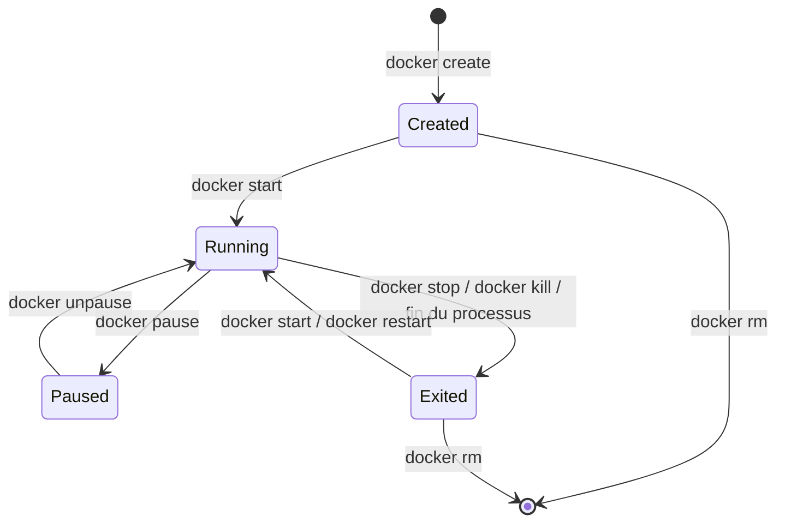



# Contexte

Votre installation fonctionne et vous savez lancer un conteneur. Avant d'écrire vos propres images, il faut savoir exploiter celles des autres : les démarrer avec la bonne configuration, comprendre dans quel état elles se trouvent, lire ce qu'elles racontent et les empêcher de consommer toutes les ressources de la machine.

Ce TP n'utilise aucun `Dockerfile`. Le fil rouge est l'image officielle `nginx`, un serveur web dont chaque paramètre (port, fichiers servis, configuration, logs) se vérifie immédiatement dans un navigateur ou avec `curl`. Les tests de limites utilisent `alpine`.

> Les commandes sont écrites pour un shell bash ou zsh (Linux, macOS, WSL). Sous PowerShell, remplacez `$PWD` par `${PWD}` et `curl` par `curl.exe`.

Créez un dossier de travail **dans votre répertoire personnel** (Colima et Docker Desktop ne partagent par défaut que celui-ci avec leur VM) :

```bash
mkdir -p ~/tp2 && cd ~/tp2
```

---

## Objectifs

<div class="section objective">

1. Lire le contenu et les métadonnées d'une image sans la lancer
2. Faire passer un conteneur par tous les états de son cycle de vie
3. Publier un port, monter un dossier ou un volume, injecter des variables d'environnement
4. Lire les logs d'un conteneur et exécuter des commandes à l'intérieur
5. Observer la consommation d'un conteneur et lui imposer des limites de mémoire et de CPU

</div>

---

## Étape 1 - Anatomie d'une image

Une image n'est pas qu'un système de fichiers : elle contient aussi des **métadonnées** qui décrivent comment la lancer (commande par défaut, ports, variables d'environnement, signal d'arrêt).

**Ce que vous devez faire :**

- Téléchargez l'image `nginx` avec le tag `stable-alpine`, puis listez vos images locales.
- Affichez l'historique de l'image : les couches qui la composent et l'instruction qui a produit chacune d'elles.
- Inspectez l'image et relevez : la commande par défaut (`Cmd`), le point d'entrée (`Entrypoint`), les ports déclarés (`ExposedPorts`), les variables d'environnement (`Env`) et le signal d'arrêt (`StopSignal`).

**Questions de réflexion :**

- Pourquoi préférer un tag comme `stable-alpine` à `latest` ? Est-ce suffisant pour garantir que deux machines exécutent exactement la même image ?
- Certaines lignes de l'historique ont une taille de `0B`. Qu'est-ce que cela signifie ?

{::nomarkdown}
<details><summary>Solution - Étape 1</summary>
{:/nomarkdown}

```bash
docker pull nginx:stable-alpine
docker images
docker history nginx:stable-alpine
docker image inspect nginx:stable-alpine
```

`docker image inspect` renvoie un long document JSON. L'option `--format` (ou `-f`) extrait les champs utiles avec la syntaxe des templates Go :

```bash
docker image inspect -f '{{.Config.Entrypoint}} {{.Config.Cmd}}' nginx:stable-alpine
docker image inspect -f '{{json .Config.ExposedPorts}}' nginx:stable-alpine
docker image inspect -f '{{json .Config.Env}}' nginx:stable-alpine
docker image inspect -f '{{.Config.StopSignal}}' nginx:stable-alpine
```

On obtient notamment :

- `Entrypoint` : `[/docker-entrypoint.sh]`, un script qui prépare la configuration au démarrage (il servira à l'étape 6) ;
- `Cmd` : `[nginx -g daemon off;]`, la commande passée en argument au point d'entrée. `daemon off` garde nginx au premier plan : s'il passait en arrière-plan, le processus principal se terminerait et le conteneur avec lui ;
- `ExposedPorts` : `{"80/tcp":{}}` ;
- `StopSignal` : `SIGQUIT`, le signal d'arrêt propre de nginx.

Un tag est une **étiquette mobile** : `stable-alpine` pointera vers une nouvelle image à la prochaine version de nginx ou d'Alpine. Il est plus explicite que `latest`, mais pas immuable. Pour figer exactement une image, on la référence par son **digest** (empreinte du contenu), visible avec `docker images --digests` :

```bash
docker pull nginx@sha256:<digest>
```

Les lignes à `0B` de `docker history` correspondent à des instructions qui ne modifient que les métadonnées (`CMD`, `EXPOSE`, `ENV`, `STOPSIGNAL`...) et ne créent donc pas de fichiers.

{::nomarkdown}
</details>
{:/nomarkdown}

---

## Étape 2 - Le cycle de vie d'un conteneur

Un conteneur passe par plusieurs états, et chaque commande de la CLI le fait passer de l'un à l'autre :



`docker run` n'est qu'un raccourci pour `docker create` suivi de `docker start`.

**Ce que vous devez faire :**

- Créez un conteneur nommé `cycle` à partir de `nginx:stable-alpine` **sans le démarrer**. Vérifiez son état avec `docker ps -a`.
- Démarrez-le, puis mettez-le en pause. Essayez d'exécuter une commande dedans pendant la pause (`docker exec cycle ls`). Sortez-le de pause.
- Arrêtez-le avec `docker stop` et relevez son code de sortie.
- Redémarrez-le, puis arrêtez-le cette fois avec `docker kill`. Relevez le nouveau code de sortie.
- Affichez uniquement les conteneurs arrêtés, puis un tableau personnalisé avec le nom, l'image et le statut de chaque conteneur.
- Essayez de supprimer `cycle` alors qu'il tourne, puis supprimez-le.

**Questions de réflexion :**

- Quelle est la différence entre `docker stop` et `docker kill` ? Pourquoi les codes de sortie diffèrent-ils ?
- Que fait `docker stop` si le processus ignore le signal d'arrêt ?
- Que devient un processus mis en pause ? Consomme-t-il encore de la mémoire ? du CPU ?

{::nomarkdown}
<details><summary>Solution - Étape 2</summary>
{:/nomarkdown}

```bash
docker create --name cycle nginx:stable-alpine
docker ps -a                       # STATUS : Created

docker start cycle
docker pause cycle
docker exec cycle ls               # erreur : le conteneur est en pause
docker unpause cycle

docker stop cycle
docker inspect -f '{{.State.Status}} {{.State.ExitCode}}' cycle    # exited 0

docker start cycle
docker kill cycle
docker inspect -f '{{.State.Status}} {{.State.ExitCode}}' cycle    # exited 137
```

Filtrer et formater la liste des conteneurs :

```bash
docker ps -a --filter status=exited
docker ps -a --format 'table {{.Names}}\t{{.Image}}\t{{.Status}}'
```

Supprimer un conteneur en cours d'exécution échoue, sauf avec `-f` :

```bash
docker start cycle
docker rm cycle        # refusé : le conteneur tourne
docker rm -f cycle     # arrêt forcé (SIGKILL) puis suppression
```

`docker stop` envoie le signal d'arrêt déclaré par l'image (`SIGQUIT` pour nginx, `SIGTERM` par défaut), qui laisse au processus le temps de terminer proprement ses requêtes. nginx sort alors avec le code `0`. Si le processus est toujours là après le délai de grâce (10 secondes par défaut, modifiable avec `docker stop -t`), Docker envoie `SIGKILL`.

`docker kill` envoie directement `SIGKILL` (signal 9), qui ne peut être ni intercepté ni ignoré. Par convention, un processus tué par un signal sort avec le code `128 + numéro du signal`, soit `137`. Un code `137` dans un `docker ps -a` doit toujours faire penser à un arrêt brutal, y compris par manque de mémoire (étape 8).

`docker pause` gèle les processus avec le cgroup *freezer* : ils ne reçoivent plus de temps CPU mais conservent toute leur mémoire. C'est différent de `stop`, qui termine les processus.

{::nomarkdown}
</details>
{:/nomarkdown}

---

## Étape 3 - Publier un port

L'instruction `EXPOSE 80` de l'image est **documentaire** : elle indique sur quel port l'application écoute, mais ne rend rien accessible depuis l'hôte. Pour cela, il faut **publier** le port au lancement.

**Ce que vous devez faire :**

- Lancez en arrière-plan un conteneur `web` à partir de `nginx:stable-alpine`, en publiant son port 80 sur le port 8080 de l'hôte.
- Ouvrez <http://localhost:8080> dans un navigateur, ou utilisez `curl`.
- Affichez les correspondances de ports du conteneur avec `docker port`.
- Lancez un second conteneur `web2` qui publie lui aussi sur le port 8080 de l'hôte. Lisez l'erreur.
- Relancez `web2` en le rendant accessible **uniquement depuis votre machine**, sur le port 8081.

**Questions de réflexion :**

- Pourquoi deux conteneurs peuvent-ils écouter tous les deux sur leur port 80, mais pas être publiés tous les deux sur le port 8080 de l'hôte ?
- Que se passe-t-il avec `-P` (majuscule) ?

{::nomarkdown}
<details><summary>Solution - Étape 3</summary>
{:/nomarkdown}

```bash
docker run -d --name web -p 8080:80 nginx:stable-alpine
curl http://localhost:8080
docker port web
```

`-d` (*detached*) rend la main immédiatement et affiche l'identifiant du conteneur. `docker port` affiche par exemple :

```text
80/tcp -> 0.0.0.0:8080
80/tcp -> [::]:8080
```

Le second lancement sur le même port échoue :

```bash
docker run -d --name web2 -p 8080:80 nginx:stable-alpine
# Error response from daemon: ... Bind for 0.0.0.0:8080 failed: port is already allocated
```

Le conteneur `web2` a tout de même été **créé** (état `Created`) : il faut le supprimer avant de réutiliser son nom.

```bash
docker rm web2
docker run -d --name web2 -p 127.0.0.1:8081:80 nginx:stable-alpine
```

Chaque conteneur a sa propre pile réseau (namespace réseau) et donc son propre port 80. En revanche, le port publié est un port de l'**hôte**, qui ne peut être attribué qu'une fois.

Par défaut, `-p 8080:80` écoute sur toutes les interfaces (`0.0.0.0`) : le service est joignable depuis le réseau local, et sous Linux, les règles iptables de Docker contournent le pare-feu de la machine. Préfixer avec `127.0.0.1` limite l'accès à la machine elle-même, ce qu'il faut faire pour tout service de développement ou toute base de données.

`-P` publie tous les ports déclarés par `EXPOSE` sur des ports aléatoires de l'hôte, que l'on retrouve avec `docker port`.

{::nomarkdown}
</details>
{:/nomarkdown}

---

## Étape 4 - Logs et exécution de commandes

Un conteneur bien conçu écrit ses logs sur sa sortie standard et sa sortie d'erreur. Docker les capture, et `docker logs` les restitue.

**Ce que vous devez faire :**

- Affichez les logs du conteneur `web`.
- Suivez-les en continu, puis rechargez plusieurs fois <http://localhost:8080> dans votre navigateur. Arrêtez le suivi avec `Ctrl+C`.
- Affichez uniquement les 5 dernières lignes, avec leur horodatage, puis uniquement celles des 2 dernières minutes.
- Ouvrez un shell dans le conteneur `web`. Regardez le contenu de `/var/log/nginx`, puis vérifiez la configuration de nginx avec `nginx -t`. Sortez du shell.
- Exécutez `nginx -t` **sans** ouvrir de shell.

**Questions de réflexion :**

- nginx écrit traditionnellement dans `/var/log/nginx/access.log`. Comment ces lignes arrivent-elles dans `docker logs` ?
- Vous quittez le shell ouvert avec `docker exec` : le conteneur s'arrête-t-il ? Et si vous quittez le shell d'un conteneur lancé avec `docker run -it alpine sh` ?

{::nomarkdown}
<details><summary>Solution - Étape 4</summary>
{:/nomarkdown}

```bash
docker logs web
docker logs -f web               # Ctrl+C pour arrêter le suivi, pas le conteneur
docker logs --tail 5 -t web
docker logs --since 2m web
```

```bash
docker exec -it web sh
ls -l /var/log/nginx
nginx -t
exit

docker exec web nginx -t
```

Dans l'image, les fichiers de logs sont des liens symboliques vers les sorties standard du processus :

```text
access.log -> /dev/stdout
error.log -> /dev/stderr
```

nginx croit écrire dans des fichiers, mais tout part dans les flux capturés par Docker. C'est la convention à suivre pour toute application conteneurisée : pas de fichiers de logs dans le conteneur, des flux standard que l'outillage (Docker, Kubernetes, un collecteur de logs) récupère.

`docker exec` lance un **processus supplémentaire** dans un conteneur déjà en marche. Le quitter n'arrête que ce processus. Avec `docker run -it alpine sh`, le shell est le processus principal (PID 1) : le quitter arrête le conteneur.

{::nomarkdown}
</details>
{:/nomarkdown}

---

## Étape 5 - Volumes : faire vivre les données hors du conteneur

Tout ce qui est écrit dans un conteneur disparaît avec lui. Deux mécanismes permettent de stocker des données à l'extérieur :

| Type | Syntaxe | Emplacement des données |
| --- | --- | --- |
| Bind mount | `-v /chemin/hôte:/chemin/conteneur` | Un dossier de votre choix sur l'hôte |
| Volume nommé | `-v nom-du-volume:/chemin/conteneur` | Un espace géré par Docker |

**Ce que vous devez faire :**

- Créez un fichier `~/tp2/site/index.html` contenant un titre de votre choix.
- Lancez un conteneur `site` qui sert ce dossier à la place de la page par défaut de nginx (le contenu servi se trouve dans `/usr/share/nginx/html`), publié sur le port 8082. Vérifiez dans le navigateur.
- Modifiez `index.html` **sur l'hôte** et rechargez la page, sans toucher au conteneur.
- Essayez de créer un fichier dans `/usr/share/nginx/html` depuis le conteneur. Faites en sorte que cela soit impossible en relançant `site` avec un montage en lecture seule.
- Créez maintenant un volume nommé `site-data`, et lancez un conteneur `persist` qui le monte sur `/usr/share/nginx/html`. Listez le contenu du volume depuis le conteneur.
- Modifiez `index.html` depuis le conteneur `persist`, supprimez ce conteneur, puis relancez-en un nouveau avec le même volume. Votre modification a-t-elle survécu ?
- Listez et inspectez les volumes.

**Questions de réflexion :**

- Le volume `site-data` était vide à sa création. Pourquoi contient-il la page par défaut de nginx au premier lancement ? Est-ce aussi le cas avec un bind mount ?
- Dans quels cas choisir un bind mount, et dans quels cas un volume nommé ?

{::nomarkdown}
<details><summary>Solution - Étape 5</summary>
{:/nomarkdown}

Bind mount :

```bash
mkdir -p ~/tp2/site
echo '<h1>Servi depuis mon hôte</h1>' > ~/tp2/site/index.html

docker run -d --name site -p 8082:80 -v "$PWD/site":/usr/share/nginx/html nginx:stable-alpine
curl http://localhost:8082

echo '<h1>Modifié sans toucher au conteneur</h1>' > ~/tp2/site/index.html
curl http://localhost:8082
```

Le conteneur voit le dossier de l'hôte en direct : il n'y a pas de copie. Il peut aussi y écrire, et ses fichiers apparaissent sur l'hôte :

```bash
docker exec site touch /usr/share/nginx/html/depuis-le-conteneur
ls ~/tp2/site
```

En lecture seule avec `:ro` :

```bash
docker rm -f site
docker run -d --name site -p 8082:80 -v "$PWD/site":/usr/share/nginx/html:ro nginx:stable-alpine
docker exec site touch /usr/share/nginx/html/test    # Read-only file system
```

Volume nommé :

```bash
docker volume create site-data
docker run -d --name persist -p 8083:80 -v site-data:/usr/share/nginx/html nginx:stable-alpine
docker exec persist ls /usr/share/nginx/html         # 50x.html index.html

docker exec persist sh -c 'echo "<h1>Je survis au conteneur</h1>" > /usr/share/nginx/html/index.html'
docker rm -f persist
docker run -d --name persist -p 8083:80 -v site-data:/usr/share/nginx/html nginx:stable-alpine
curl http://localhost:8083                            # la modification est toujours là

docker volume ls
docker volume inspect site-data
docker inspect -f '{{json .Mounts}}' persist
```

Quand un volume nommé **vide** est monté sur un dossier qui contient déjà des fichiers dans l'image, Docker copie ces fichiers dans le volume. Un bind mount ne fait jamais cette copie : il masque le contenu de l'image par celui du dossier de l'hôte, même vide.

`docker volume inspect` indique un `Mountpoint` sous `/var/lib/docker/volumes/`. Sous Windows et macOS, ce chemin se trouve dans la VM, pas sur votre disque.

En pratique :

- **bind mount** : partager des fichiers que vous éditez sur l'hôte (code source en développement, fichier de configuration) ;
- **volume nommé** : stocker les données produites par l'application (base de données, fichiers uploadés), dont Docker gère l'emplacement et les permissions.

La syntaxe `--mount` est plus verbeuse mais plus explicite, et recommandée dans les scripts : `--mount type=volume,source=site-data,target=/usr/share/nginx/html`.

{::nomarkdown}
</details>
{:/nomarkdown}

---

## Étape 6 - Configurer un conteneur par l'environnement

Une même image doit pouvoir tourner en développement, en recette et en production. Ce qui change d'un environnement à l'autre passe par des **variables d'environnement**, pas par une nouvelle image.

L'image `nginx` officielle propose un mécanisme pour cela : au démarrage, son point d'entrée lit les fichiers `*.template` du dossier `/etc/nginx/templates/`, y remplace les références `${VARIABLE}` par la valeur des variables d'environnement, et écrit le résultat dans `/etc/nginx/conf.d/`.

**Ce que vous devez faire :**

- Créez le fichier `~/tp2/templates/default.conf.template` suivant :

  ```nginx
  server {
      listen ${NGINX_PORT};

      location / {
          root  /usr/share/nginx/html;
          index index.html;
          add_header X-Environment "${APP_ENV}";
      }
  }
  ```

- Lancez un conteneur `config` qui monte ce dossier sur `/etc/nginx/templates`, définit `NGINX_PORT=8000` et `APP_ENV=dev`, et publie le bon port du conteneur sur le port 8084 de l'hôte.
- Vérifiez l'en-tête renvoyé avec `curl -I http://localhost:8084`, puis affichez la configuration générée dans le conteneur.
- Placez les mêmes variables dans un fichier `app.env`, avec `APP_ENV=prod`, et relancez le conteneur en utilisant ce fichier.
- Retrouvez les variables du conteneur de deux façons : depuis l'extérieur avec `docker inspect`, et depuis l'intérieur.
- Relancez le conteneur **sans** définir `APP_ENV`. Que se passe-t-il ? Trouvez la cause.

**Questions de réflexion :**

- Pourquoi l'option `-p` doit-elle changer quand `NGINX_PORT` change ?
- Vous devez passer un mot de passe de base de données à un conteneur. Qui peut le lire si vous utilisez une variable d'environnement ?

{::nomarkdown}
<details><summary>Solution - Étape 6</summary>
{:/nomarkdown}

```bash
mkdir -p ~/tp2/templates
# créer default.conf.template avec le contenu ci-dessus

docker run -d --name config -p 8084:8000 \
  -v "$PWD/templates":/etc/nginx/templates:ro \
  -e NGINX_PORT=8000 -e APP_ENV=dev \
  nginx:stable-alpine

curl -I http://localhost:8084       # X-Environment: dev
docker exec config cat /etc/nginx/conf.d/default.conf
```

Avec un fichier d'environnement :

```bash
cat > app.env <<'EOF'
NGINX_PORT=8000
APP_ENV=prod
EOF

docker rm -f config
docker run -d --name config -p 8084:8000 \
  -v "$PWD/templates":/etc/nginx/templates:ro \
  --env-file app.env \
  nginx:stable-alpine

curl -I http://localhost:8084       # X-Environment: prod
docker inspect -f '{{json .Config.Env}}' config
docker exec config env
```

Les variables définies par l'image (`NGINX_VERSION`, `PATH`...) apparaissent à côté des vôtres.

Sans `APP_ENV` :

```bash
docker rm -f config
docker run -d --name config -p 8084:8000 \
  -v "$PWD/templates":/etc/nginx/templates:ro \
  -e NGINX_PORT=8000 \
  nginx:stable-alpine

docker ps -a --filter name=config   # Exited (1)
docker logs config
```

Le point d'entrée ne remplace que les variables **définies**. `${APP_ENV}` reste donc tel quel dans la configuration, et nginx l'interprète comme l'une de ses propres variables, qui n'existe pas. Les logs se terminent par une erreur du type `[emerg] unknown "app_env" variable` : nginx refuse de démarrer, le processus principal se termine, le conteneur aussi. Réflexe à retenir : un conteneur qui s'arrête aussitôt lancé se diagnostique avec `docker ps -a` (code de sortie) puis `docker logs`.

`-p 8084:8000` associe un port de l'hôte à un port **du conteneur**. Si nginx écoute sur 8000, publier le port 80 ne mènerait nulle part.

Une variable d'environnement est visible par quiconque peut exécuter `docker inspect` sur l'hôte, ainsi que dans `/proc/<pid>/environ` du processus et par tout processus enfant. Elle convient pour la configuration, pas pour des secrets sensibles, pour lesquels on préfère un fichier monté en lecture seule ou un gestionnaire de secrets (Docker Swarm, Kubernetes, Vault...).

{::nomarkdown}
</details>
{:/nomarkdown}

---

## Étape 7 - Observer un conteneur en fonctionnement

**Ce que vous devez faire :**

- Affichez en continu la consommation de vos conteneurs (CPU, mémoire, réseau, disque). Dans un second terminal, générez du trafic sur `web` et observez les colonnes qui évoluent :

  ```bash
  for i in $(seq 1 2000); do curl -s http://localhost:8080 > /dev/null; done
  ```

- Affichez la même information une seule fois, pour le seul conteneur `web`.
- Affichez les processus qui tournent dans `web`, tels que l'hôte les voit.
- Avec `docker inspect` et `--format`, affichez pour `web` : son adresse IP, sa date de démarrage, son nombre de redémarrages et sa politique de redémarrage.

**Questions de réflexion :**

- Dans `docker stats`, que représente la valeur après le `/` dans la colonne `MEM USAGE / LIMIT` ?
- Les PID affichés par `docker top` sont-ils les mêmes que ceux vus par `ps` dans le conteneur ? Pourquoi ?

{::nomarkdown}
<details><summary>Solution - Étape 7</summary>
{:/nomarkdown}

```bash
docker stats                      # Ctrl+C pour quitter
docker stats --no-stream web
docker top web
```

```bash
docker inspect -f '{{range .NetworkSettings.Networks}}{{.IPAddress}}{{end}}' web
docker inspect -f '{{.State.StartedAt}}' web
docker inspect -f '{{.RestartCount}} {{.HostConfig.RestartPolicy.Name}}' web
```

Pendant la boucle de requêtes, `NET I/O` augmente et le CPU de `web` monte légèrement.

Sans limite, `LIMIT` affiche toute la mémoire disponible pour Docker : celle de l'hôte sous Linux, celle de la VM sous Windows et macOS. L'étape suivante fixe une vraie limite.

`docker top` affiche les PID vus depuis l'hôte (ou la VM), tandis que `ps` dans le conteneur affiche ceux de son namespace, où nginx a le PID 1. C'est le même processus, numéroté différemment selon le point de vue.

{::nomarkdown}
</details>
{:/nomarkdown}

---

## Étape 8 - Limiter la mémoire et le CPU

Par défaut, un conteneur peut consommer toute la mémoire et tout le CPU disponibles. Un seul conteneur défaillant peut ainsi dégrader tous les autres. Docker s'appuie sur les **cgroups** du noyau pour imposer des limites.

> Sous Windows et macOS, les limites s'appliquent à l'intérieur de la VM Docker. Un conteneur ne peut jamais dépasser la mémoire et les CPU attribués à cette VM (`docker info` les affiche dans `Total Memory` et `CPUs`).

**Ce que vous devez faire :**

*Mémoire.* La commande `dd if=/dev/zero of=/dev/null bs=128M count=1` alloue un tampon de 128 Mo pour copier un unique bloc.

- Lancez-la dans un conteneur `alpine` nommé `mem-ok`, sans limite. Relevez son code de sortie.
- Lancez-la dans un conteneur `mem-ko` limité à 64 Mo de mémoire, sans swap. Relevez le code de sortie, puis vérifiez avec `docker inspect` que le conteneur a bien été tué par manque de mémoire.

*CPU.* La commande `yes > /dev/null` occupe un cœur à 100 %.

- Lancez-la en arrière-plan dans un conteneur `cpu` limité à un demi-CPU. Observez sa consommation avec `docker stats`.
- Sans redémarrer le conteneur, passez sa limite à 2 CPU. La consommation atteint-elle 200 % ?
- Lancez un conteneur `cpu2` qui exécute **deux** commandes `yes` en parallèle avec une limite de 1,5 CPU, et observez.
- Demandez plus de CPU que n'en possède votre machine (ou votre VM). Lisez l'erreur.

**Questions de réflexion :**

- Pourquoi faut-il préciser `--memory-swap` en plus de `--memory` pour obtenir un arrêt net ?
- Une limite de mémoire dépassée tue le processus. Une limite de CPU atteinte le ralentit seulement. Pourquoi cette différence ?
- Pourquoi la redirection `> /dev/null` doit-elle être placée dans un `sh -c '...'` ?

{::nomarkdown}
<details><summary>Solution - Étape 8</summary>
{:/nomarkdown}

Mémoire :

```bash
docker run --name mem-ok alpine dd if=/dev/zero of=/dev/null bs=128M count=1
docker inspect -f '{{.State.ExitCode}}' mem-ok                         # 0

docker run --name mem-ko --memory 64m --memory-swap 64m \
  alpine dd if=/dev/zero of=/dev/null bs=128M count=1
docker inspect -f '{{.State.ExitCode}} {{.State.OOMKilled}}' mem-ko    # 137 true
```

Le noyau a tué le processus dès qu'il a dépassé 64 Mo : c'est l'**OOM killer** (*Out Of Memory*). On retrouve le code `137` (SIGKILL) vu à l'étape 2, et `OOMKilled` indique la cause.

`--memory-swap` fixe la limite **mémoire + swap**. S'il n'est pas précisé, il vaut le double de `--memory` : le conteneur pourrait alors déborder sur le swap au lieu d'être tué, et devenir simplement très lent. Lui donner la même valeur que `--memory` interdit le swap.

CPU :

```bash
docker run -d --name cpu --cpus 0.5 alpine sh -c 'yes > /dev/null'
docker stats --no-stream cpu          # CPU % autour de 50 %

docker update --cpus 2 cpu
docker stats --no-stream cpu          # autour de 100 %, pas 200 %

docker run -d --name cpu2 --cpus 1.5 alpine sh -c 'yes > /dev/null & yes > /dev/null & wait'
docker stats --no-stream cpu2         # autour de 150 %
```

Dans `docker stats`, 100 % correspond à un cœur entièrement occupé. `yes` est un processus mono-thread : il ne peut occuper qu'un seul cœur, quelle que soit la limite. Avec deux processus, la consommation monte jusqu'au plafond de 1,5 CPU.

Au-delà du nombre de CPU disponibles, Docker refuse :

```bash
docker run --rm --cpus 64 alpine true
# Error response from daemon: range of CPUs is from 0.01 to N.00, as there are only N CPUs available
```

La mémoire ne peut pas être « ralentie » : un processus qui a besoin d'une page de plus l'obtient ou non. Le CPU, en revanche, se partage dans le temps : le noyau accorde au conteneur une part de chaque période (par défaut 100 ms), puis le met en attente jusqu'à la suivante. Le processus est ralenti, jamais tué.

Sans `sh -c`, la redirection `> /dev/null` serait interprétée par **votre** shell, sur l'hôte : c'est la sortie de la commande `docker run` qui serait redirigée, et `yes` écrirait dans les logs du conteneur.

Pour aller plus loin : `--cpuset-cpus` épingle un conteneur sur des cœurs précis, et `--pids-limit` limite le nombre de processus (protection contre les *fork bombs*).

{::nomarkdown}
</details>
{:/nomarkdown}

---

## Étape 9 - Faire le ménage

**Ce que vous devez faire :**

- Affichez l'espace disque occupé par Docker (images, conteneurs, volumes, cache).
- Supprimez tous les conteneurs créés dans ce TP, **et seulement eux**.
- Supprimez le volume `site-data`.
- Supprimez les images qui ne sont plus utilisées par aucun conteneur.
- Affichez de nouveau l'espace disque occupé.

**Question de réflexion :**

- Pourquoi `docker rm -f $(docker ps -aq)` est-elle une commande dangereuse sur une machine de travail ?

{::nomarkdown}
<details><summary>Solution - Étape 9</summary>
{:/nomarkdown}

```bash
docker system df

docker rm -f web web2 site persist config mem-ok mem-ko cpu cpu2
docker volume rm site-data
docker image prune -a

docker system df
```

`docker image prune -a` supprime toutes les images qu'aucun conteneur n'utilise, pas seulement celles de ce TP. Il demande confirmation : lisez la liste avant de répondre.

`docker rm -f $(docker ps -aq)` supprime **tous** les conteneurs de la machine, y compris ceux qui tournent et qui n'ont rien à voir avec ce TP (une base de données de développement, par exemple). Nommer explicitement ses conteneurs, comme dans ce TP, permet de les cibler précisément.

{::nomarkdown}
</details>
{:/nomarkdown}

---

## Récapitulatif des commandes

| Commande | Rôle |
| --- | --- |
| `docker pull` | Télécharger une image |
| `docker images` | Lister les images locales |
| `docker history` | Afficher les couches d'une image |
| `docker image inspect` | Afficher les métadonnées d'une image |
| `docker create` / `docker start` | Créer un conteneur / le démarrer |
| `docker run` | Créer et démarrer un conteneur en une commande |
| `docker pause` / `docker unpause` | Geler / dégeler les processus d'un conteneur |
| `docker stop` / `docker kill` | Arrêter proprement / tuer un conteneur |
| `docker restart` | Arrêter puis redémarrer un conteneur |
| `docker rm` | Supprimer un conteneur |
| `docker ps` | Lister les conteneurs (`-a` pour tous, `--filter`, `--format`) |
| `docker port` | Afficher les ports publiés |
| `docker logs` | Lire les logs (`-f`, `--tail`, `--since`, `-t`) |
| `docker exec` | Exécuter une commande dans un conteneur en marche |
| `docker volume` | Créer, lister, inspecter, supprimer des volumes |
| `docker inspect` | Afficher l'état et la configuration d'un conteneur |
| `docker stats` | Suivre la consommation de ressources |
| `docker top` | Lister les processus d'un conteneur |
| `docker update` | Modifier les limites d'un conteneur à chaud |
| `docker system df` / `docker image prune` | Mesurer et libérer l'espace disque |

| Option de `docker run` | Rôle |
| --- | --- |
| `-d` | Lancer en arrière-plan |
| `--name` | Nommer le conteneur |
| `-p hôte:conteneur` | Publier un port |
| `-v source:cible[:ro]` | Monter un dossier de l'hôte ou un volume |
| `-e VAR=valeur` / `--env-file` | Définir des variables d'environnement |
| `--memory` / `--memory-swap` | Limiter la mémoire |
| `--cpus` | Limiter le CPU |
| `--rm` | Supprimer le conteneur à sa sortie |


